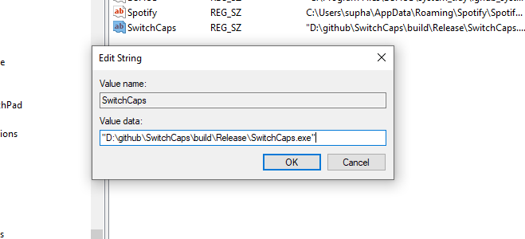

# SwitchCaps
This program is made for those who want to use the Caps Lock key to change the language (... similar to Mac OS). This project is virus-free, completely safe, and open source.

## Setup
1. Windows + R and type "regedit"
2. goto HKEY_CURRENT_USER\SOFTWARE\Microsoft\Windows\CurrentVersion\Run
3. Right click -> Click new -> String Value
4. Type any name up to you
5. Type in Value data "Path of SwitchCaps.exe"



## How to Use
Click to open the program to start using it immediately. When you want to open the program, click to open it again. A window will pop up asking you.

> [!NOTE]
> Shift + Caps Lock to toggle caps lock

## Tool
* Visual Studio 2026 & Visual Studio Code
* CMAKE

## Clone
```bash
git clone https://github.com/exsycore/SwitchCaps.git
cd SwitchCaps
```

## Build
```bash
mkdir build
cd build
cmake .. -T ClangCL
cmake --build .
```
